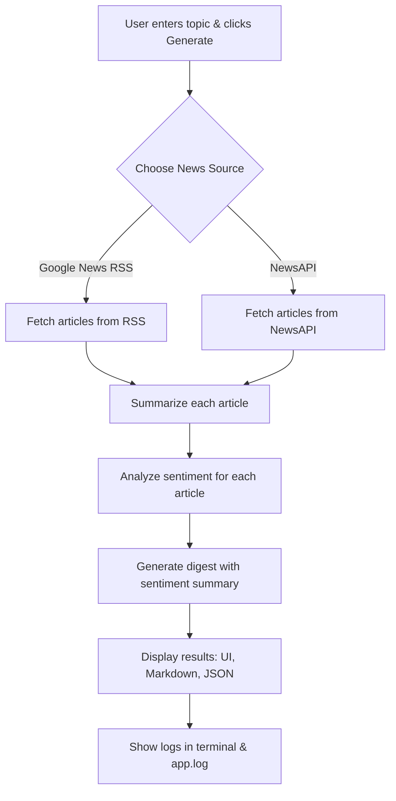

# AI News Digest Assistant


## Overview

AI News Digest Assistant is a Streamlit-based web application that fetches, summarizes, and analyzes news articles on any topic using OpenAI and NewsAPI. It provides sentiment analysis, key takeaways, and a beautiful, interactive UI.

---

## Features
- Fetch news from Google News RSS (free) and NewsAPI (optional)
- Summarize articles using OpenAI GPT-3.5 Turbo
- Sentiment analysis for each article (positive, negative, neutral)
- Sentiment summary in the daily digest (e.g., "3 Positive, 1 Negative, 1 Neutral")
- Key entities extraction
- Executive summary and detailed article breakdown
- Downloadable Markdown and JSON reports
- Beautiful, modern UI with custom CSS
- Full logging to both terminal and `app.log`

---

## Flow Chart



---

## Setup Instructions

1. **Clone the repository**
2. **Install dependencies**
   ```bash
   pip install -r requirements.txt
   ```
3. **Create a `.env` file** in the project root:
   ```
   OPENAI_API_KEY=your_openai_key_here
   NEWS_API_KEY=your_news_api_key_here
   ```
   - Get your OpenAI key: https://platform.openai.com/api-keys
   - Get your NewsAPI key: https://newsapi.org/register
4. **Run the app**
   ```bash
   streamlit run app.py
   ```

---

## Usage

- Enter a topic in the main input box
- Select news source and number of articles in the sidebar
- Click "Generate News Digest"
- View summaries, sentiment, key entities, and download reports

---

## Logging

- All API calls, responses, and errors are logged to both the terminal and `app.log` for debugging and traceability.

---

## File Structure

```
├── app.py              # Main Streamlit app
├── app.log             # Log file
├── .env                # API keys
├── requirements.txt    # Python dependencies
├── README.md           # This file
└── flow_chart.png      # Flow chart image (auto-generated or export from mermaid)
```

---

## Dependencies
- streamlit
- openai
- requests
- feedparser
- python-dotenv
- mermaid (for flow chart, or export as PNG)

---

## API Keys
- **OpenAI API Key** (required)
- **NewsAPI Key** (optional, for more sources)

---

## Customization
- You can add more news sources by extending the `NewsDigestAssistant` class
- UI can be further customized via CSS in `app.py`

---

## License
MIT

---

## Author
- Akshay Chame

---

## Flow Chart Export
To export the flow chart as an image, use [Mermaid Live Editor](https://mermaid-js.github.io/mermaid-live-editor/) and save as `flow_chart.png`.
# ai_news_digest
